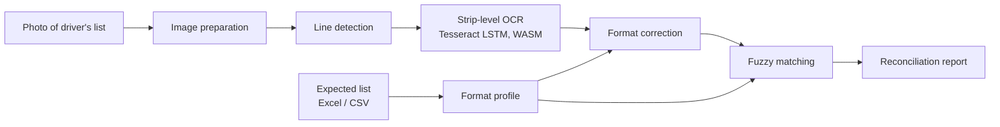

<div align="center">

# Delivery Verification System

**Reconcile inbound deliveries in minutes: read the driver's printed box list with a camera and check it against what you ordered.**

[](https://atharvguitarist.github.io/delivery-verification/)
[](#)
[](#recognition-pipeline)
[](#data-handling--privacy)
[](#license)

[**Open the app →**](https://atharvguitarist.github.io/delivery-verification/)

</div>

---

## The problem

When a truck arrives, the receiving team has two lists: the **expected list** (what was ordered, usually an Excel export) and the **driver's printed list** (what the carrier says is on board). Checking one against the other by hand is slow, error-prone and hard to audit. One misread digit in a long box number means a missing box goes unnoticed.

## What it does

The Delivery Verification System turns that check into a three-step workflow:

1. **Load the expected list.** Upload the Excel or CSV file and pick the column with the box numbers.
2. **Photograph the driver's list.** Take one photo per page with a phone or upload images.
3. **Get the result.** Every box is marked **arrived**, **not arrived** or **unexpected**, and the result can be exported as an Excel or PDF report.

Everything runs on the device in the browser. Delivery documents and photos are never sent to any server.

## Key capabilities

| | |
|---|---|
| **Format-aware OCR** | Learns the structure of your box numbers from the expected list and uses it to correct common camera and print misreads. |
| **Tolerant matching** | Fuzzy matching resolves near-misses to the right box and flags anything it cannot confirm for review, so nothing is matched silently. |
| **Smart Excel import** | Detects the box-number column automatically and warns when a spreadsheet has turned long codes into rounded numbers. |
| **Scan first, compare later** | Start scanning before the expected list is available; the comparison runs as soon as it is uploaded. |
| **Audit-ready output** | Excel and PDF reports, a one-tap copy of the not-arrived list, and a clean soft copy of the driver's list. |
| **Session history** | Recent verifications are stored on the device and can be reopened later. |
| **Built for the dock** | Responsive layout for warehouse handsets and laptops, with light and dark themes. |

## Recognition pipeline

General-purpose OCR is not reliable enough for long alphanumeric codes on thermal printouts photographed under warehouse lighting. The app uses a dedicated pipeline built around that problem:



- **Image preparation.** Photos are resized, converted to luminance and processed block by block to compensate for uneven lighting and shadows.
- **Line detection and strip OCR.** The page is split into individual text lines, and each strip is read separately by a multi-worker Tesseract LSTM engine running in WebAssembly. This is noticeably more accurate than reading a whole page at once.
- **Format profiling.** The expected list is analysed to learn which character positions are digits and which are letters for every code length.
- **Format correction.** OCR output is reshaped against that profile, so classic confusions (`O`/`Q`/`D`↔`0`, `I`/`L`↔`1`, `S`↔`5`, `B`↔`8`, `Z`↔`2`, `G`↔`6`) are fixed using the position's expected type.
- **Fuzzy matching.** The remaining tokens are matched to the expected list by edit distance. Ambiguous candidates are surfaced for the operator to confirm instead of being accepted automatically.

## Architecture

The system follows a **client-side, edge-first architecture**: recognition, matching, storage and report generation all run on the operator's device.

| Layer | Technology |
|---|---|
| Interface | HTML5, CSS, vanilla JavaScript (single-page app) |
| OCR engine | Tesseract.js, LSTM model, WebAssembly with SIMD builds, bundled locally |
| Spreadsheet I/O | SheetJS |
| PDF reports | jsPDF + AutoTable |
| Persistence | IndexedDB (on-device) |
| Hosting | GitHub Pages over HTTPS |

Why this design:

- **Privacy by design.** Manifests and photos stay on the device.
- **Works at the dock.** After the first load, nothing depends on network round-trips.
- **Zero operating cost and nothing to maintain.** There are no servers to patch, scale or secure.
- **Instant rollout.** Any handset with a modern browser is ready to use; nothing to install.

## Data handling & privacy

- **Local processing.** Excel files and photos are processed entirely in the browser.
- **Local storage.** Recent verifications are kept in IndexedDB on the device that created them. They are not synced between devices and are removed if the browser's site data is cleared, so **export the report for anything that must be retained.**
- **Network use** is limited to loading static assets (web fonts and the spreadsheet library) on first visit.
- **No analytics, tracking or cookies.**

## Browser support

| Browser | Status |
|---|---|
| Chrome / Edge (desktop & Android) | ✅ Recommended |
| Safari (macOS & iOS) | ✅ Supported |
| Firefox | ⚠️ Works; not the primary target |
| In-app / embedded web views | ❌ The OCR engine may not start. Open the link in Chrome or Safari |

## Project structure

```
.
├── index.html     # Application: UI, recognition pipeline, matching and reporting
├── tess/          # Tesseract OCR engine (WASM/SIMD builds) and English LSTM model
├── lib/           # jsPDF + AutoTable for PDF report generation
├── .github/       # Repository ownership (CODEOWNERS)
└── .nojekyll      # Serve files as-is on GitHub Pages
```

## Deployment

The app is published with **GitHub Pages** from the `main` branch (root folder) at
**https://atharvguitarist.github.io/delivery-verification/**. Changes merged into `main` go live within about a minute.

To run it locally, serve the folder with any static web server. Opening `index.html` directly from disk will not start the OCR workers.

```bash
python3 -m http.server 8080
# open http://localhost:8080
```

## Change control

`main` is the production branch and is **protected**:

- Force pushes and branch deletion are blocked.
- Changes are merged through reviewed pull requests with a linear history.
- Every file is owned by the maintainer via `CODEOWNERS`, and their approval is required to merge.

External contributions are not accepted.

## Security

Please **do not** report security issues in public GitHub issues. See [SECURITY.md](SECURITY.md) for how to report a vulnerability privately.

## License

Copyright © 2026 [@atharvguitarist](https://github.com/atharvguitarist). All rights reserved.

This repository is publicly visible for hosting purposes only. No licence is granted to use, copy, modify or distribute the code without prior written permission.

### Third-party components

| Component | License |
|---|---|
| [Tesseract.js](https://github.com/naptha/tesseract.js) | Apache-2.0 |
| [jsPDF](https://github.com/parallax/jsPDF) | MIT |
| [jsPDF-AutoTable](https://github.com/simonbengtsson/jsPDF-AutoTable) | MIT |
| [SheetJS Community Edition](https://sheetjs.com) | Apache-2.0 |
